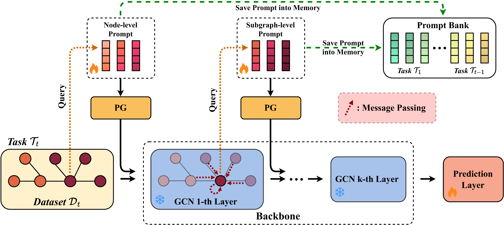

<h1 align="center">
Prompt-Driven Continual Graph Learning
</h1>

[Qi Wang](), [Tianfei Zhou](https://www.tfzhou.com/), [Ye Yuan](), [Rui Mao]()

----------

## Abstract
Continual Graph Learning (CGL), which aims to accommodate new tasks over evolving graph data without forgetting prior knowledge, is garnering significant research interest. Mainstream solutions adopt the memory replay-based idea, ie, caching representative data from earlier tasks for retraining the graph model. However, this strategy struggles with scalability issues for constantly evolving graphs and raises concerns regarding data privacy. Inspired by recent advancements in the prompt-based learning paradigm, this paper introduces a novel prompt-driven continual graph learning (PROMPTCGL) framework, which learns a separate prompt for each incoming task and maintains the underlying graph neural network model fixed. In this way, PROMPTCGL naturally avoids catastrophic forgetting of knowledge from previous tasks. More specifically, we propose hierarchical prompting to instruct the model from both feature- and topology-level to fully address the variability of task graphs in dynamic continual learning. Additionally, we develop a personalized prompt generator to generate tailored prompts for each graph node while minimizing the number of prompts needed, leading to constant memory consumption regardless of the graph scale. Extensive experiments on four benchmarks show that PROMPTCGL achieves superior performance against existing CGL approaches while significantly reducing memory consumption. 

<div align="center">
  
</div>
<br>

----

## Installation
Please first clone the repo and install the required environment, which can be done by running the following commands:
```
conda env create -n promptcgl python=3.10

conda activate promptcgl

#### CUDA 12.2
conda install pytorch==1.13.1 pytorch-cuda=11.7 -c pytorch -c nvidia

git clone https://github.com/QiWang98/PromptCGL.git
cd PromptCGL

pip install -r requirements.txt
```

----
## Training and Evaluation
```
python main.py --dataset-name=corafull --cgl-method=PromptCGL
```
